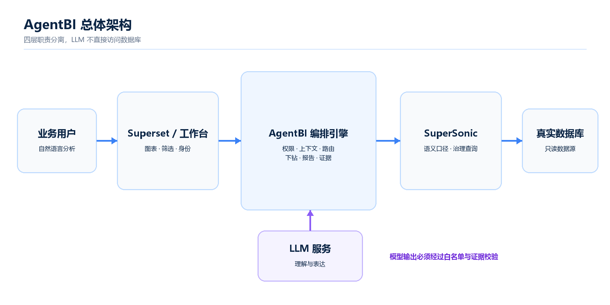
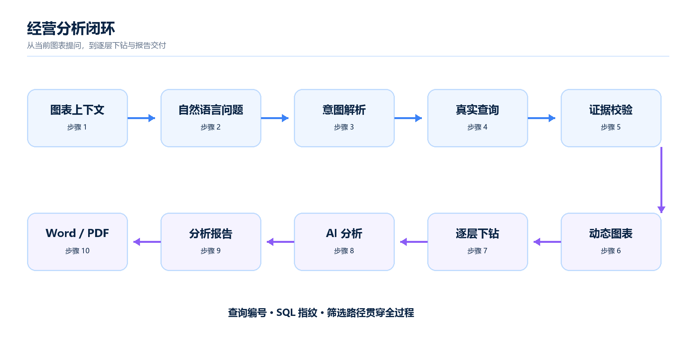
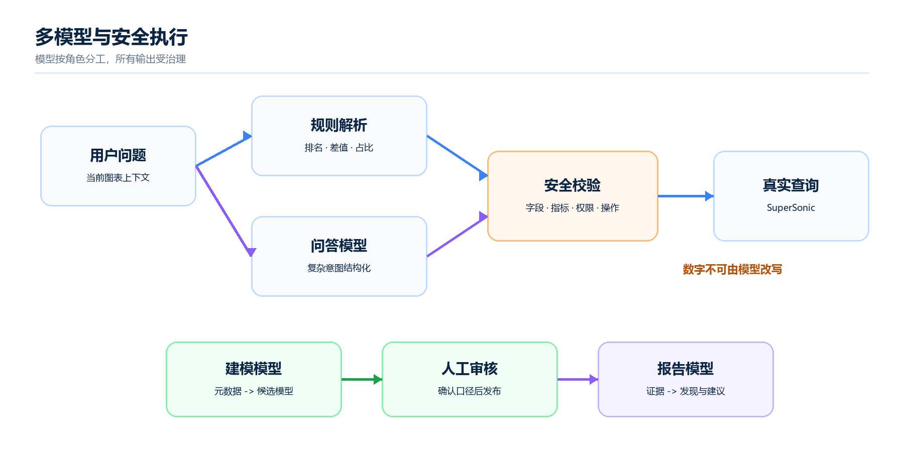

# InsightPilot AgentBI 项目说明书

## 1. 赛题需求解读与项目定位

InsightPilot AgentBI 是面向企业经营分析场景的 B/S 架构智能分析平台。项目并不是在传统 BI 页面旁增加一个通用聊天框，而是把 Apache Superset 的真实仪表盘上下文、SuperSonic 的受治理语义模型和 AgentBI 的工作流编排结合起来，使业务用户能够用自然语言完成“查看图表、提出问题、获得真实查询结果、继续下钻、生成结论、形成报告”的完整闭环。

平台针对三个核心问题设计：第一，业务用户往往不能准确说出字段名和统计口径，需要系统理解当前图表的维度、指标、筛选条件、数据范围以及选中的数据点；第二，大模型生成结论时必须受真实数据和权限约束，不能把模型推测当成经营事实；第三，一次查询不能构成分析闭环，系统需要保留多轮上下文、支持逐层下钻、生成可修改和可下载的报告，并保存完整证据链。

从评审视角看，赛题考察的不只是模型能否回答一句问题，还包括数据是否真实、指标口径是否统一、上下文是否准确、结果能否复核、项目能否在新环境部署以及源码是否具备持续迭代能力。因此本项目把需求归纳为“真实数据、受治理语义、上下文感知、连续分析、证据闭环、安全交付”六项验收目标。大模型负责理解口语和组织文字，SuperSonic 与确定性程序负责查询、排名、差值和占比计算，避免把语言模型推测当成经营事实。

## 2. 整体架构设计思路

系统采用分层解耦架构。Superset 负责数据集、图表、仪表盘、筛选和登录会话；SuperSonic 负责指标、维度、同义词、业务口径及受治理查询；AgentBI 编排层负责身份校验、上下文构造、模型路由、意图解析、查询计划、证据校验、连续追问、下钻、报告和审计。浏览器只提交允许的仪表盘标识、图表标识、筛选条件和用户问题，不直接提交角色、数据库凭据或可执行 SQL。

图 1 展示四类系统的职责边界：Superset 提供真实 BI 上下文，AgentBI 执行安全编排，SuperSonic 管理语义口径并查询真实数据库，LLM 只负责意图理解、建模建议和报告表达。大模型不直接连接数据库，也不能绕过权限或修改查询数字。

工作流依次经过权限与请求校验、上下文解析、意图识别、语义查询、确定性计算、结果与证据校验、结论生成和报告持久化。简单排名、差值、占比、极值等问题优先采用规则和确定性计算；复杂意图可交由配置的大模型生成受白名单约束的结构化计划，最终数据仍由 SuperSonic 查询真实数据源。模型输出无法通过类型、字段和口径校验时，系统安全回退到规则解析或要求用户确认。

图 2 将比赛要求对应到一条可演示链路：用户从当前图表发起问题，系统完成真实查询和图表呈现，再逐层下钻并针对每层数据进行 AI 分析，最终生成可编辑、可下载且携带证据链的报告。

图 3 说明多模型不是多个模型同时自由回答，而是按任务角色路由。所有模型输出先经过字段、指标、操作和权限校验；未通过校验的内容不能进入真实查询与报告事实区。

## 3. 核心功能模块介绍

### 3.1 分析工作台

工作台同步 Superset 仪表盘和真实图表，支持表格、指标卡、横向与纵向柱状图、折线图、面积图、饼图、环图、散点图和漏斗图。用户点击单个图表的“AI 分析”后，系统固定当前 Chart ID、Dataset、维度、指标、排序和筛选范围；在全部仪表盘范围提问时，则携带仪表盘级上下文。结果区显示结论、数据表、执行步骤、查询耗时、行数、查询编号和 SQL 指纹。

### 3.2 自然语言问答与模型分工

平台允许配置多个 OpenAI-compatible 模型服务，并为“问答意图解析”“智能建模”“报告生成”分别选择模型。快速模型适合意图分类和字段映射，高质量模型适合长文本报告。密钥使用服务端加密保存，不返回浏览器；服务连接在保存前完成验证。大模型只负责理解和文本组织，不绕过 SuperSonic 查询，也不能修改结果数字。

### 3.3 智能建模

管理员可从真实 Superset Dataset 发起智能建模。系统读取 Dataset 名称、字段名、字段类型和字段描述，生成候选主题域、维度、指标、聚合方式、同义词和业务说明；管理员审核后发布到 SuperSonic。未知字段、非法聚合和不支持的类型会被拒绝。该流程支持元数据推断回退，因此即使外部模型暂时不可用，也不会破坏既有语义模型。

### 3.4 真实下钻分析

管理员为受治理图表登记下钻维度路径，例如“发行商 -> 平台 -> 游戏类型”。用户从真实查询结果中选择一个数据项后进入独立下钻分析页。页面顶部保留来源图表，下面按层级生成新的真实查询图表；每层保存筛选值、查询编号、SQL 指纹和行数，并支持“AI 分析此层”。下钻结果可继续进入下一层，也可生成可审计报告。

### 3.5 长对话与上下文压缩

每轮对话以“用户问题、语义工具调用、工具结果、助手结论”为不可拆分单元持久化。达到 Token 阈值或消息数阈值时，系统把较早的完整轮次压缩成结构化摘要，同时保留最近原始轮次。工具调用与结果保持成对，压缩边界写入数据库，服务重启后仍能继续追问，并且会话始终与用户身份绑定。

### 3.6 分析报告

报告由执行摘要、关键发现、经营建议、限制说明和不可编辑的数据证据组成。用户可修改文字、保存草稿、切换已发布状态、下载 Word 或打印为 PDF。经用户允许后，当前配置的报告模型可辅助润色关键发现与经营建议；发送内容包含必要的报告上下文和证据摘要，不发送数据库凭据，模型也不得创造或改写数据事实。

## 4. 关键技术难点及解决方案

系统执行最小权限、服务端身份注入、CSRF 防护、输入白名单、限流、超时、幂等、结果截断和结构化审计。SuperSonic 候选只有包含受治理查询结构时才可执行，网页插件或外部链接候选不会执行。原始 SQL 不返回普通浏览器，仅保留不可逆指纹供审计。日志不记录用户问题全文、Token、API Key、数据库凭据或完整结果集。

自然语言的模糊性是首要难点。“最好、最差、最多、最低、第一名比第二名高多少”等口语并不直接包含数据库字段。系统把当前图表的 Dataset、维度、指标、别名、排序和区域范围提供给解析器，常见表达先由规则识别，复杂表达再由 LLM 生成结构化计划，最后通过字段和操作白名单校验。因此不需要为每一句口语逐条硬编码，又能避免模型选错统计指标。

数据真实性是第二项难点。系统将语言理解和数据执行彻底分离：LLM 无权直接执行任意 SQL，SuperSonic 使用已发布语义模型访问真实数据库，差值、占比、排名和极值由确定性代码计算，输出绑定查询编号、行数和 SQL 指纹。第三项难点是多层下钻状态，解决方式是持久化来源图表、维度路径、每层选中值和证据，使下钻页面能够逐层重建图表而不是只在聊天框中堆叠文本。第四项难点是跨系统身份，浏览器提交的角色不被信任，必须由 Superset 服务端会话注入，并在 AgentBI 再次执行 RBAC、数据范围和 CSRF 校验。

## 5. 工程规范落地说明与扩展性

后端采用 Python 3.11+、FastAPI、Pydantic 和 SQLAlchemy；Superset 扩展与关键工作台契约采用 TypeScript。接口模型拒绝额外字段，排名、指标、维度、聚合和操作均使用白名单。查询、图表、上下文、报告和模型路由模块保持解耦，新增 Dataset 或模型服务不需要修改核心查询执行器。数据库默认使用 SQLite 实现零安装演示，切换 `AGENTBI_DATABASE_URL` 即可迁移到 PostgreSQL。

## 6. 创新功能亮点

1. 图表级上下文感知：自然语言理解同时利用当前图表的维度、指标、排序和业务范围。
2. 双引擎协作：LLM 负责理解，SuperSonic 和确定性代码负责真实查询与计算。
3. 可视化证据链：每层下钻都保留来源图表、筛选路径、查询编号、SQL 指纹和图表结果。
4. 多模型角色路由：问答、建模和报告可选择不同模型，并提供规则安全回退。
5. 可审计报告：报告文字可编辑，数据证据不可篡改，下载版本携带完整查询路径。
6. 可恢复长对话：Token/消息双触发压缩、工具对保护和边界持久化满足长期使用要求。

## 7. 测试与质量保障

当前自动化回归共 110 项，覆盖身份认证、RBAC、会话隔离、上下文压缩、提示控制、语义草稿、模型兼容、SuperSonic 协议、真实查询、下钻、报告保存、限流、幂等、结果截断和审计。2026-09-03 最新执行结果为 110 passed，存在 1 条第三方 Starlette/httpx 弃用告警，不影响运行。提交前还需在干净环境执行一键安装、全量回归和完整演示路径。

## 8. 部署与运行

本地完整演示需要 Python 3.11+、Node.js、Java、Docker Desktop、Apache Superset 源码和 SuperSonic 源码或固定构建产物。Windows 执行 `delivery/install.ps1` 完成预检和依赖安装，再执行 `scripts/start-demo.ps1` 启动；Linux/macOS 使用 `delivery/install.sh` 完成 AgentBI 安装和预检。正式环境应使用 PostgreSQL、HTTPS、Superset Guest Token 或 SSO/OIDC、独立 SuperSonic 服务身份、外部共享缓存和集中审计。

## 9. 已知限制

地图、热力图、雷达图、箱线图及复杂多维多指标图暂未开放原生建图；系统会明确提示不支持，不会用错误图形替代。示例数据包含历史年份时，需要选择覆盖数据的时间范围。完整集成依赖固定版本的 Superset 和 SuperSonic，最终提交包应附源码归档、Git submodule 或已验证构建产物，不能依赖评审现场临时下载未知版本。

## 10. LLM 配置规则

平台支持配置多个 OpenAI-compatible 模型服务，每项配置包含 Base URL、模型或部署名称、API Key 与启用状态。API Key 使用服务端密钥加密保存，浏览器仅能看到掩码。保存前系统发起真实 Chat Completions 测试，确认接口可达且返回结构包含有效的 `choices[0].message.content` 后才允许启用。配置完成后，管理员在“SuperSonic LLM 增强”区域分别指定“问答意图解析”“智能建模”“报告生成”模型并点击“应用设置”。低延迟模型适合口语解析，结构化输出稳定的模型适合建模，高质量长文本模型适合报告生成。

模型输入采用最小必要原则：问答解析只接收当前图表允许使用的维度、指标、别名、筛选与用户问题；智能建模只接收 Dataset 名称和字段元数据，不发送真实数据行；报告生成仅在用户授权后接收证据摘要和待润色文字，不发送数据库密码。所有模型输出都要经过 JSON 结构、字段白名单、指标口径与权限校验。模型超时、额度不足、协议不兼容或公网不可用时，系统回退到规则解析、元数据推断或原文报告，不影响数据库、仪表盘和下钻主链路。

## 11. IPC 通信适配说明

项目采用容器化 B/S 架构，不依赖某一种桌面操作系统的命名管道或 Electron 专属 IPC。本项目中的进程间通信统一抽象为 HTTP/REST+JSON：浏览器与 AgentBI 使用同源接口和签名会话；Superset 扩展从服务端会话取得用户、角色与数据范围后，通过受控代理访问 AgentBI；AgentBI 使用服务端 HTTP 客户端访问 Superset API、SuperSonic API 和 OpenAI-compatible 模型接口；业务数据库连接由 Superset 和 SuperSonic 管理，浏览器不能直接连接数据库。

本机开发地址为 `127.0.0.1:8088/8090/9080`，Docker Compose 内部使用 `superset`、`agentbi`、`supersonic`、`db`、`redis` 等服务名，避免写死宿主机路径。通信层统一处理连接超时、状态码映射、上游错误脱敏、结果截断、健康检查、CORS 精确白名单和幂等请求。Windows、Linux 与 macOS 共用相同协议，平台差异只在 PowerShell/Shell 启动脚本与 Docker 平台参数中适配。如果后续封装桌面客户端，可由可信主进程把现有 REST 客户端映射为桌面 IPC，并继续禁止渲染进程持有数据库与模型密钥。

## 12. 环境依赖清单

完整离线评审推荐 Docker Desktop 或 Docker Engine 与 Compose v2，主机至少 8 GB 内存和 10 GB 可用磁盘。离线镜像为 `linux/amd64`，Windows x86-64、Linux x86-64 和 Intel Mac 可直接运行，Apple Silicon Mac 由 Docker Desktop 兼容模式运行。镜像内包含 AgentBI、Superset、SuperSonic 0.8.6、PostgreSQL 17 和 Redis 7，因此目标机不必另装 Python、Node.js 或 Java。

源码开发需要 Python 3.11+、Node.js 18+、Java 17、Docker 和 Git。Python 核心依赖为 FastAPI、httpx、cryptography、Pydantic、SQLAlchemy 与 Uvicorn，开发依赖为 pytest 和 Ruff；前端使用 TypeScript 和 webpack。LLM 增强功能要求运行环境能够访问所配置的模型服务，但完全断网时仍可使用真实数据库、已有语义模型、规则问答、仪表盘和下钻能力。

## 13. 完整部署步骤

推荐使用完整离线包。第一步，解压 `delivery/offline` 并启动 Docker。第二步，Windows 在 PowerShell 执行 `Set-ExecutionPolicy -Scope Process Bypass`，再运行 `./start-offline.ps1`；macOS/Linux 执行 `chmod +x install.sh && ./install.sh`。第三步，脚本校验镜像 SHA256、加载固定版本镜像、生成本机随机密钥、恢复 Superset 元数据库与 `examples` 业务库、挂载 AgentBI SQLite 和 SuperSonic H2 配置快照，并等待健康检查。第四步，打开 `http://127.0.0.1:8090/app`，管理员账号为 `admin/admin`，普通用户为 `user/user`。Superset 地址为 `http://127.0.0.1:8088`，SuperSonic 地址为 `http://127.0.0.1:9080`。

源码部署时先把 `delivery/env.example` 复制为仅本机保存的 `.env` 并配置凭据。Windows 运行 `delivery/install.ps1`，Linux/macOS 运行 `delivery/install.sh`；完整本机演示运行 `scripts/start-demo.ps1 -UseBundledDemoCredentials`。停止服务使用 `scripts/stop-demo.ps1`，默认保留数据卷。生产环境必须替换演示账号、固定 `SUPERSET_SECRET_KEY`、使用 32 位以上随机服务密钥、启用 HTTPS，并使用只读数据库账户与 SSO/OIDC 或 Superset Guest Token。

## 14. 操作使用教程

管理员先进入“数据源”同步 Superset Database 与 Dataset，查看真实字段并补充业务说明。随后进入“语义模型”，选择 Dataset 创建智能建模草稿，检查维度、指标、聚合、同义词和下钻路径，审核后发布到 SuperSonic。再进入“仪表盘管理”选择经营总览，通过建图向导设置图表名称、类型、维度、指标、聚合、排序和显示数量。

进入“下钻配置”后选择真实 Superset 图表，绑定对应语义模型与核心指标，设置例如“平台→游戏类型→发行商”的路径。在“分析工作台”点击单图表的“AI 分析”固定上下文，可测试“哪种游戏类型销量排第 2”“北美发行商卖得最差的是哪一家”“第一名比第二名高多少，占第二名百分之几”。查询成功后从结果选择当前数据项与下一维度，点击“进入下钻分析”；下钻页顶部保留来源图表，下方逐层产生新图表，每层均可执行“AI 分析此层”。

完成分析后生成报告。报告页允许 AI 辅助完善执行摘要、关键发现和经营建议，也允许人工修改。点击“保存修改”即可持久化，无需先改成已发布；“已发布”仅表示业务内容已确认，不代表公开到互联网。最后下载 Word 或打印为 PDF，并通过“查看证据”核对下钻路径、查询编号、行数和数据摘要。

## 15. 测试结果总结

截至 2026-09-03（北京时间），后端自动化回归结果为 110 passed、0 failed、1 warning。唯一告警为 Starlette TestClient 与 httpx 的第三方弃用提示，不影响功能。覆盖范围包括登录与会话撤销、RBAC、数据范围、CSRF、输入白名单、密钥保护、审计脱敏、上下文压缩、用户隔离、SuperSonic 协议、候选过滤、真实查询、超时异常、模型兼容、智能建模校验、排名/差值/占比/极值、下钻路径、筛选继承、报告创建编辑保存、证据保护、限流、幂等与结果截断。

工程验证同时通过 Ruff 静态检查、Python 编译检查、TypeScript 类型检查和前端生产构建。数据库交付已验证 `video_game_sales` 完整 CSV 为 16,595 行，数据快照 SHA256 一致，数据库 Compose 配置有效。完整离线环境曾使用独立 Compose 项目和备用端口完成真实启动验证，AgentBI、Superset 健康检查与工作台页面均成功，恢复后包含 10 个仪表盘、112 张图表及完整视频游戏销量数据。

综上，项目已经形成从数据接入、语义治理、自然语言问答、可视化下钻到分析报告的完整闭环。系统以真实数据和可审计证据为中心，利用多模型提高理解与表达能力，并以确定性计算、权限边界和安全回退保证结果可信，具备比赛演示、离线交付和后续工程迭代基础。
