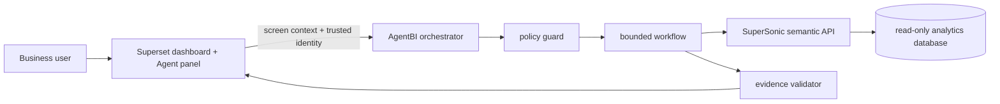

# AgentBI MVP architecture

## Ownership boundaries

| Capability | System of record |
|---|---|
| Dashboard, chart, visible filters | Superset |
| Metrics, dimensions, synonyms, joins | SuperSonic |
| Workflow, tool policy, evidence, audit | AgentBI orchestrator |
| Physical business data | Read-only analytics database |

Only identifiers cross boundaries. The orchestrator does not copy semantic definitions into
its own database, which prevents metric drift between the dashboard and Agent answers.

## Workflow states

The implemented flow is `AUTHORIZE -> RATE_LIMIT/IDEMPOTENCY -> SEMANTIC_QUERY ->
VALIDATE_EVIDENCE -> SYNTHESIZE -> REPORT`. AgentBI owns actor-bound recent question history;
access to SuperSonic's stateless governed-query context is serialized because the inspected
upstream build can route newly persisted chats to WEB_PAGE plugins. Only candidates containing
a governed `querySQL` are executable, and the SQL text is replaced with a fingerprint at the
browser boundary.

## Superset integration contract

The dashboard adapter captures `dashboard_id`, `chart_id`, `dataset_id`, `time_range`, native
filters, and the last selected data point. The backend adds the authenticated subject and roles.
Roles supplied directly by browser JavaScript must never be accepted in a production deployment.

## Failure behavior

- Invalid context: reject with HTTP 422 without calling SuperSonic.
- Invalid identity or prompt-control pattern: reject with HTTP 403.
- SuperSonic timeout/error: return HTTP 502 without upstream internals.
- Excessive data: truncate at the server limit and attach a warning.
- Missing answer prose: return a deterministic result-count summary with evidence.
- Repeated client request: return the cached response during the idempotency window.
- Excessive actor request rate: reject with HTTP 429 and a bounded retry hint.
